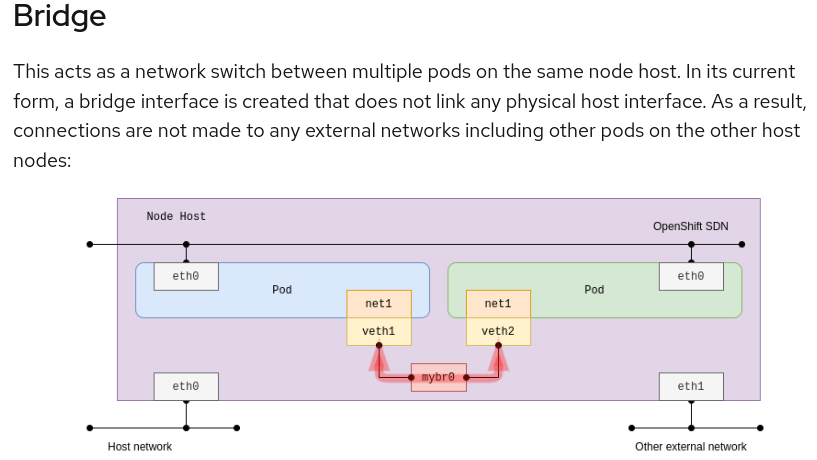
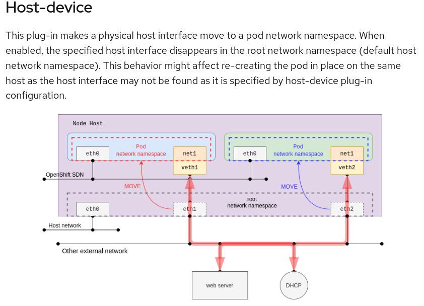
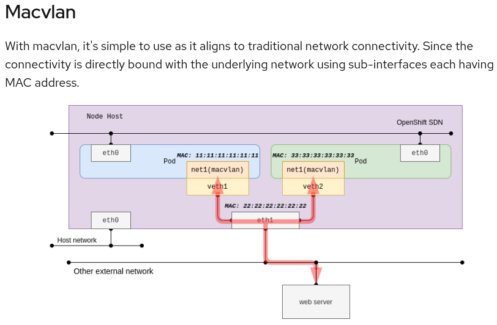
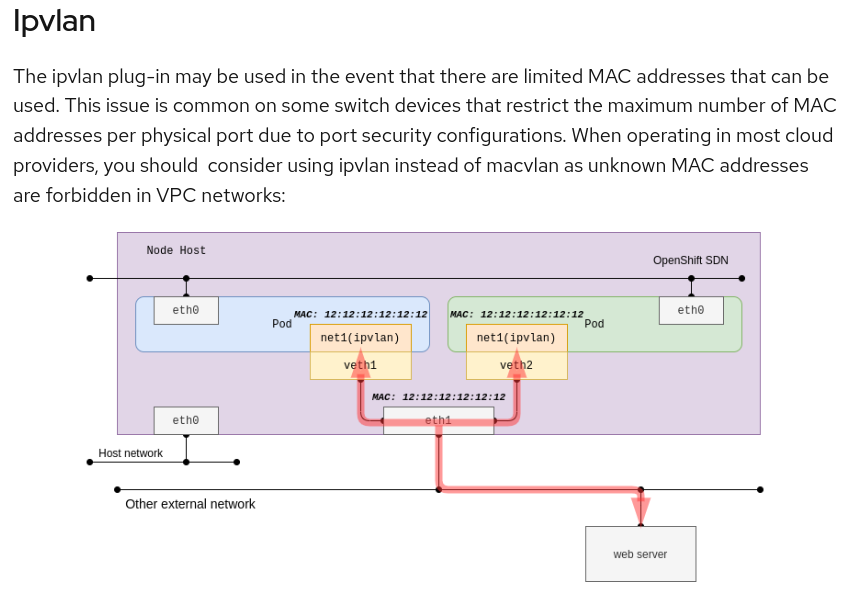

# Multus CNI Testing Repository

## Introduction

This repository is dedicated to testing and demonstrating the capabilities of the [Multus CNI](https://github.com/k8snetworkplumbingwg/multus-cni) plugin in a Kubernetes environment. Multus CNI is an extended Container Network Interface (CNI) plugin that enables attaching multiple network interfaces to pods in Kubernetes. It acts as a "meta-plugin" that calls other CNI plugins and allows for configuring multiple networking interfaces in a single pod. This repository is highly inspired by the insights shared in the [Red Hat blog post on using the Multus CNI in OpenShift](https://cloud.redhat.com/blog/using-the-multus-cni-in-openshift).

## Multus CNI Overview

Multus CNI provides the flexibility of combining different networking solutions, enabling more complex networking topologies and addressing more advanced networking needs in Kubernetes. It supports all reference CNI plugins (like Flannel, DHCP, Macvlan) alongside with several others.

## Repository Structure

This repository contains configurations and YAML definitions for testing different network interfaces using Multus CNI, including:

- **Bridge**
- **Host-Device**
- **Macvlan**
- **Ipvlan**

Additionally, a `clean` directory is included for cleanup scripts and instructions in /clean. This script could be run in case of a weird behaviour in MultusCNI.

To provide better context, different figures extracted from [Red Hat blog post on using the Multus CNI in OpenShift](https://cloud.redhat.com/blog/using-the-multus-cni-in-openshift) have been attached:

## Getting Started

To get started with testing:

1. Clone the repository in a deviced with access to the kube-apiserver (e.g: kubemaster)
2. Navigate to the directory of the network type you wish to test (e.g., `cd bridge`).
3. Apply the YAML files using `kubectl apply -f <filename>.yaml`.

Refer to the individual `readme.txt` files in each directory for more detailed instructions or notes about each networking type.
